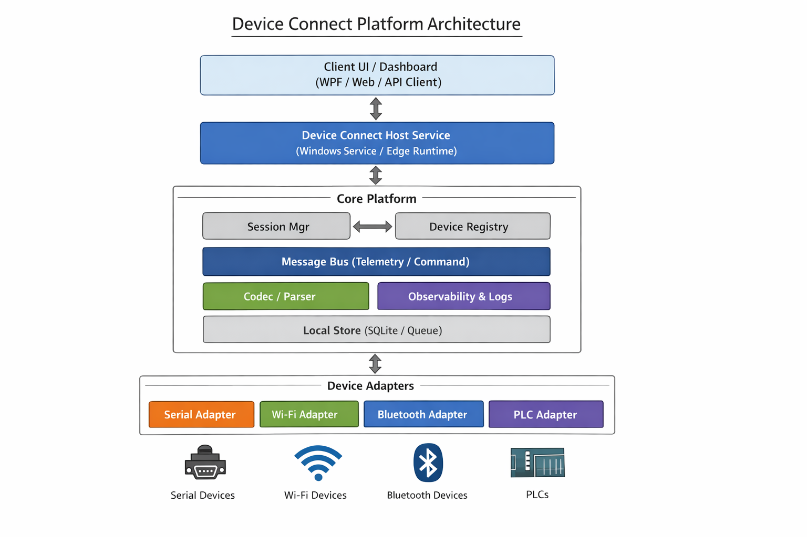

# Device Connect Platform (Serial • Wi‑Fi • Bluetooth • PLC)

A **plugin-based connectivity platform** that provides a single, consistent API to connect, stream telemetry, and send commands to:
- **Serial devices** (COM/USB/RS232/RS485)
- **Wireless devices** (**Wi‑Fi** and **Bluetooth**)
- **PLC devices** (industrial protocols)

> This repo is a **reference architecture + runnable skeleton** (not a complete protocol implementation).  
> Add your device codecs and protocol mappings inside the adapter projects.

---

## Architecture



```
flowchart LR
  UI[UI / Client App] -->|gRPC/REST/WebSocket| HOST[Host Service]

  subgraph Core["Core Platform"]
    BUS[Message Bus]
    SM[Session Manager]
    REG[Device Registry]
    CODEC[Codec / Parser]
    OBS[Observability (Logs/Metrics/Tracing)]
    STORE[Local Store (SQLite Queue)]
    SEC[Security / Policy]
  end

  HOST --> Core
  HOST --> BUS
  HOST --> SM
  HOST --> REG
  SM --> STORE
  BUS --> STORE
  CODEC --> BUS
  OBS --> HOST

  subgraph Adapters["Device Adapters (Plugins)"]
    SER[Serial Adapter]
    WIFI[Wi‑Fi Adapter]
    BLE[Bluetooth Adapter]
    PLC[PLC Adapter]
  end

  REG --> Adapters
  SER -->|Frames| CODEC
  WIFI -->|Packets| CODEC
  BLE -->|GATT| CODEC
  PLC -->|Tags/Registers| CODEC

  subgraph Devices
    D1[Serial Device]
    D2[Wi‑Fi Device]
    D3[Bluetooth Device]
    D4[PLC]
  end

  SER <--> D1
  WIFI <--> D2
  BLE <--> D3
  PLC <--> D4
```

### Key ideas
- **One unified contract**: telemetry, commands, events use shared message models.
- **Pluggable adapters**: add new transports/protocols without touching the core.
- **Resilience**: reconnect, backoff, watchdog, offline queue.
- **Diagnostics-first**: structured logs, metrics, connection timeline.

---

## Repo layout

```
src/
  DeviceConnect.Core/            # Contracts + bus + sessions + registry
  DeviceConnect.Adapters.Serial/
  DeviceConnect.Adapters.Wifi/
  DeviceConnect.Adapters.Bluetooth/
  DeviceConnect.Adapters.Plc/
  DeviceConnect.Host.Service/    # Minimal host (background service)
  DeviceConnect.Host.Console/    # Console demo runner
tests/
  DeviceConnect.Tests/
docs/
  ADRs/
```

---

## Quick start

### 1) Build
```bash
dotnet build
```

### 2) Run console demo
```bash
dotnet run --project src/DeviceConnect.Host.Console
```

The demo:
- registers adapters
- starts a session
- simulates telemetry + command/ack flow

---

## Where to implement your device logic

- **Transport connection**: inside `Adapters.*` (Serial/Wi‑Fi/Bluetooth/PLC)
- **Protocol framing + CRC**: inside `Core/Codecs`
- **Device profile (JSON)**: inside `Core/Profiles`
- **PLC tag/register map**: inside `Adapters.Plc/Mappings`

---

## License
MIT
